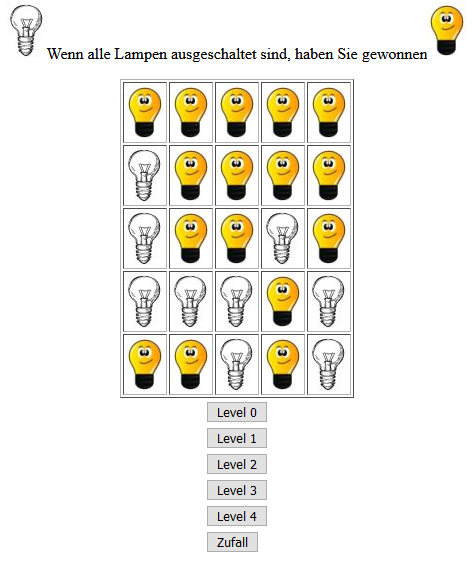

# Lampenspiel (May 2017)
 *by Elias Theis ([@eliastheis](https://github.com/eliastheis))* and Julian Weber ([@juwbr](https://github.com/juwbr))

## How it works
You have to switch every lamp off. By clicking a lamp, the directly attached lamps and the clicked one will invert their state.

## Start your own adventure
Open the Affenpuzzle.html in the browser of your choice.

## Screenshot

